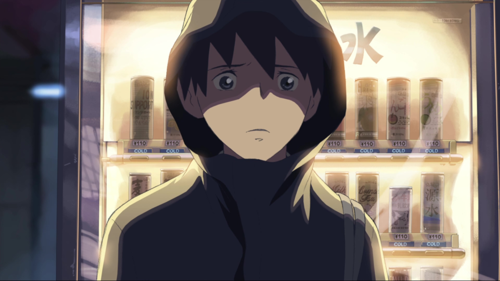

## 樱花抄
人们在小时候经常会有这么一种时刻：认为自己所认知到的周围便是世界的全部，一切的事情理所当然的发生，熟知的人也会一直不变的留在身边。当这一切发生变化的时候，他们就会感到强烈的不安和担忧。例如说，很小的你身边一直有父母照料，可是当你上幼儿园时见不到父母，便害怕得嚎啕大哭；又或者你第一次独自出远门，紧张得不知道如何跟售票员交流...即使这种变化在以后看来并非多么负面的，甚至是不值一提的。他们长大以后，或许会嗤笑当时的自己小题大做，但这其实是无法避免的，几乎所有人都要经历的过程。其本质上是对未知的恐惧，因此就算是在成年后，这种经历依然存在。通过这种变化，人们对世界的认识才会更加的深刻。
电影里面把这种不安通过各种手段渲染得淋漓尽致。其中有两个片段给我印象最深，同时也是我最能产生共情的片段。第一个是普通的学校放学的场景，耳边是下课的铃声和学生的说话声。社团的前辈像往常一样邀请贵树去参加部活，但贵树拒绝了。习以为常的日常从这里开始割裂，未曾经历过的时间忽然有了实感，他接下来就要去搭乘好几个小时的列车，去见明里。旅行前的准备是最让人兴奋的时刻，可如果你对旅行不仅仅只有期待，还有一些其他不安定的情绪，那么想必心情就不会那么纯粹了。

  
之后是贵树在中途站下车买饮料的时候，信在不经意间被吹走了，随着冬季的风消逝在凛冽的夜色里。我们不知道信上写了什么（好像小说有提到？至少动画里无从得知了），但可以肯定的是，那一定是面对明里时讲不出来的话。想对明里说的话被暴风雪无情地敲打，消散于无形。同时被敲打的还有贵树的内心。列车晚点，可能见不到明里了；就算见到了，他们间的关系是否还和以前一样未曾改变？更进一步的，他们这种异地恋一般的关系，又该去往何方？失去的大概不只是信件，也包括他们之间因距离而变得丝般渺茫的联系。种种的不安被急剧放大，那一刻，贵树似乎感受到了来自广阔世界的恶意。鼻子一酸，但却强忍着不让自己哭出来，在寒风中孤独地品味泪水。

